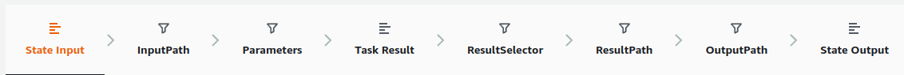

- https://dev.to/vikasgarghb/step-functions-with-localstack-42
- https://eu-west-3.console.aws.amazon.com/states/home?region=eu-west-3#/visual-editor
- https://eu-west-3.console.aws.amazon.com/states/home?region=eu-west-3#/simulator
- amazon/aws-stepfunctions-local
- avatarnewyork/statelint

## Apprentisage 

List des erreurs
- States.ALL
  - A wildcard that matches any known error name.
- States.DataLimitExceeded
  - A States.DataLimitExceeded exception will be thrown for the following:
    - When the output of a connector is larger than payload size quota.
    - When the output of a state is larger than payload size quota.
    - When, after Parameters processing, the input of a state is larger than the payload size quota.
    - https://docs.aws.amazon.com/step-functions/latest/dg/limits-overview.html
- States.Runtime
  - An execution failed due to some exception that could not be processed. Often these are caused by errors at runtime, such as attempting to apply InputPath or OutputPath on a null JSON payload. A States.Runtime error is not retriable, and will always cause the execution to fail. A retry or catch on States.ALL will not catch States.Runtime errors.
- States.HeartbeatTimeout
  - A Task state failed to send a heartbeat for a period longer than the HeartbeatSeconds value.
- States.Timeout
  - A Task state either ran longer than the TimeoutSeconds value, or failed to send a heartbeat for a period longer than the HeartbeatSeconds value.
- States.TaskFailed
  - A Task state failed during the execution. When used in a retry or catch, States.TaskFailed acts as a wildcard that matches any known error name except for States.Timeout.
- States.Permissions
  - A Task state failed because it had insufficient privileges to execute the specified code.

Unhandled errors in Lambda are reported as Lambda.Unknown in the error output. These include out-of-memory errors and function timeouts. You can match on Lambda.Unknown, States.ALL, or States.TaskFailed to handle these errors. When Lambda hits the maximum number of invocations, the error is Lambda.TooManyRequestsException. For more information about Lambda Handled and Unhandled errors, see FunctionError in the AWS Lambda Developer Guide.

Retry:
- ErrorEquals
- IntervalSeconds
- MaxAttempts
- BackoffRate

Fallback states:
- ErrorEquals
- Next
- ResultPath

List des types de state:
- Pass
- Task
- Choice
- Wait
- Succeed
- Fail
- Parallel
- Map

Examples using Retry and using Catch:
- Handling a timeout using Retry
- Handling a failure using Catch
- Handling a failure using Retry

Intrinsic functions:
- States.format('Hello, my name is {}', $.name)
  - Placeholder replace
- States.StringToJson('{"a": 1}")
  - Parse json 
- States.JsonToString($.data)
  - Print data as json
- States.Array($.Id)
  - Create an array from multiple values 

Workflow sur une state:
- StateInput (obligatoire)
  - Each state in a state machine receives JSON as input and passes JSON as output.
  - The state input can be reduced using one or many filters available to the state.
- InputPath (si omis l'input passe au travers)
  - Use the InputPath filter to select a portion of the JSON state input to use. 
  - Specify which part of the JSON to use with a JSONPath expression .
- Parameters (si omis l'input passe au travers)
  - The Parameters fields allows you to create a collection of key-value pairs that are passed as input to an AWS service integration such as
    - a Lambda function invocation
    - or an Activity worker .
  - The values can be 
    - static, or 
    - they can be selected from the filtered input using a JSONPath expression  (for ex. $.myStateInput.value). 
    - For key-value pairs where the value is selected with a JSONPath expression, the key name must end in “.$” 
- TaskResult (obligatoire) (à verifier si pas de réponse)
  - The task result is the response from the AWS service integration  or Activity worker .
  - . Test the resource you are calling with Step Functions and enter its response into the data simulator.
- ResultSelector (si omis l'input passe au travers)
  - Work only with state (Map, Task, Parallel)
  - Use the ResultSelectoor filter to construct a new JSON object using parts of the task result.
  - The values can be static, or they can be selected from the task result using a JSONPath expression  (for ex. $.myStateInput.value).
  - For key-value pairs where the value is selected with a JSONPath expression, the key name must end in “.$” .
- ResultPath (si omis l'input passe au travers)
  - Use ResultPath to add the result into the original state input. The specified path indicates where to add the result.
    - If ResultPath is unspecified or $, the result becomes the output and the state input is discarded.
    - If ResultPath is a JSONPath expression, the result will be inserted into the state input.
- OutputPath (si omis l'input passe au travers)
  - The OutputPath filter allows you to filter the final result before it becomes the state output.
- StateOutput (obligatorie)
  - This is the final state output.

Les groupes se divisent en deux INPUT et OUTPUT.

On retrouve InputPath et OutputPath qui sont capable seulement de choisir une portion de json.
- A noter que l'outputPath agis après ResultPath.
On retrouve Parameters et ResultSelector qui sont capable de réecrire le json en utilisant du static mais aussi des valeurs dynamique.
On retrouve StateInput, TaskResult et StateOutput qui ne sont pas des filtre c'est juste l'entrée/résultat/sortie.
On retrouve le cas particulier du ResultPath qui est capable de modifié la sortie pour qu'elle contienne l'entréer plus la sortie 
- Si $.Result elle sera injecter à l'endroit voulu.
- Si null alors seul le contenu de l'entrée persiste.
- L'input utilisé est celui original de tout modification par Parameters et InputPath.
- Attention si le resultPath utilise comme clé de destination une clé présente dans l'input originel alors elle sera écrasé.

A noter que tous les filtre utilise une JSONPATH Expression. même une chaine non json est un json mais sans structure.
Par example {"color": blue}, la couleur est accéssible via "$.color". Structure complexe multi data.
Si c'est juste blue alors la couleur est accéssible via "$". Structure simple uni data.

