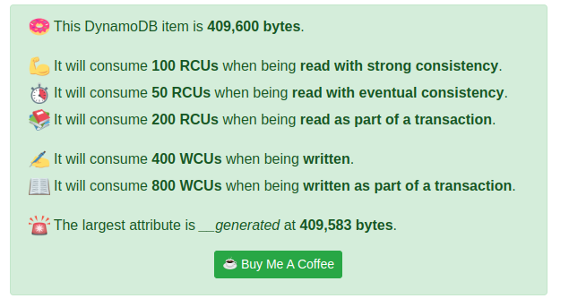

## Objectifs
- Creér une dynamo table
- Créer un flux dynamo stream
- Voir pour la gestion des partitions qui sont lié à du SSDU
- regarder l'adaptation en live du rcu/wcu
  - dans le cas du adaptive
  - dans le cas du fixe
  - dans le cas du fixe + autoscaling
- calculer le rcu/wcu néscéssaire

## Appentisage
https://github.com/Dynobase/dynobase
https://docs.aws.amazon.com/fr_fr/amazondynamodb/latest/developerguide/AdditionalResources.html
https://docs.aws.amazon.com/amazondynamodb/latest/developerguide/CapacityUnitCalculations.html
https://zaccharles.github.io/dynamodb-calculator/
https://dynobase.dev/dynamodb-capacity-and-item-size-calculator/
https://quick-adviser.com/how-does-dynamodb-calculate-item-size/
https://zaccharles.medium.com/calculating-a-dynamodb-items-size-and-consumed-capacity-d1728942eb7c
https://docs.aws.amazon.com/amazondynamodb/latest/developerguide/HowItWorks.NamingRulesDataTypes.html

### Limits
- 400KB per item
  - Cette limite inclu l'item + ses indexs
- 1MB par Scan
- 1MB par Query
- 16MB par BatchGetItem / 100 Items max
- 16MB par BatchWriteItem / 25 Items max

### Size
- Transactional = tranche de 8 kibibytes (4096 bytes)
- Consistent = tranche de 4 kibibytes (4096 bytes)
- Eventual = tranche de 2 kibibytes (2048 bytes)

### Apprentissages
- Quand on fait Scan ou Query la consomation est faite sur la taille du résultat et non sur l'addition des items.
- Point intéréssant quand on augmente la taille d'un item via put par example la capacité consomé augmente tout de suite en revanche quand on la diminue elle redescent au second appel uniquement
## Test

### 20 lines / 400kb per line / 1000 RCU (eventual)

`bin/console add --nb-lines 20 --size-format er -- 1000`

