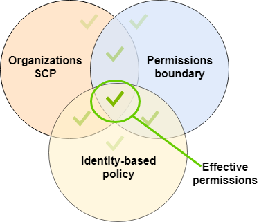
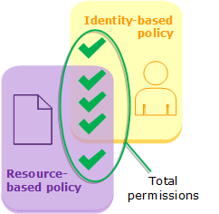

## objectifs
- Se connecter à une bdd RDS via iam
- Se connecter à une bdd Aurora via iam
  - https://docs.aws.amazon.com/AmazonRDS/latest/UserGuide/UsingWithRDS.IAMDBAuth.html
- créer une policy en ligne de commande
- créer un role en ligne de commande
- mettre à jour une policy customer managed
- mettre à jour une policy inline

- créer une policy SCP
- créer une boundary limit policy
- créer une policy qui bloque la création de ressource en dehors d'une région

## Apprentissage
https://docs.aws.amazon.com/IAM/latest/UserGuide/reference_policies_evaluation-logic.html

SCP / Boundary / Identity 

